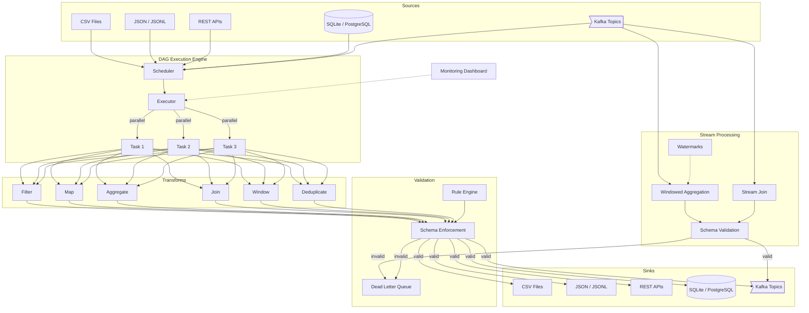
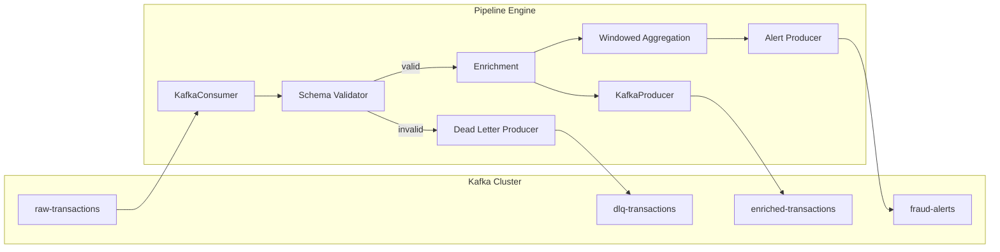

# data-pipeline-engine

[](https://github.com/gcasti256/data-pipeline-engine/actions/workflows/ci.yml)
[](https://www.python.org/downloads/)
[](https://opensource.org/licenses/MIT)

A DAG-based data pipeline framework for Python with built-in connectors, data validation, streaming support, and a monitoring dashboard.

Build ETL/ELT pipelines programmatically or declaratively via YAML — the framework handles dependency resolution, parallel execution, retry logic, schema validation, and dead-letter routing out of the box.

## Architecture



## Features

- **DAG Execution Engine** — Topologically sorted task execution with configurable parallelism, per-node retry with exponential backoff, and comprehensive state tracking
- **7 Built-in Connectors** — CSV, JSON/JSONL, REST API (with pagination & auth), SQLite, PostgreSQL, Kafka (source + sink)
- **6 Transform Operations** — Filter (expressions), Map (computed columns), Aggregate (group-by), Join (hash-based), Window (sliding), Deduplicate
- **Event-Driven Streaming** — Kafka consumer/producer with JSON and Avro serialization, windowed aggregations (tumbling, sliding, session), stream joins, watermarks, and exactly-once semantics
- **Schema Registry** — JSON Schema and Avro validation with Confluent Schema Registry compatibility, schema versioning and evolution
- **Data Validation** — Pydantic schema enforcement, pluggable rule engine, dead-letter queue for failed records
- **Streaming Mode** — Process large datasets with time/count-based batch windows without loading everything into memory
- **Monitoring Dashboard** — FastAPI-powered REST API for pipeline run status, per-node metrics, and aggregate throughput stats
- **YAML Configuration** — Define entire pipelines declaratively with batch or streaming mode; the framework instantiates connectors, transforms, and wires the DAG
- **CLI** — Run, validate, and monitor pipelines from the command line

## Quick Start

### Installation

```bash
pip install -e .

# With PostgreSQL support
pip install -e ".[postgres]"

# With Kafka streaming support
pip install -e ".[kafka]"

# Everything
pip install -e ".[all]"

# Development
pip install -e ".[dev]"
```

### Programmatic API

```python
import asyncio
from pipeline_engine.core import DAG, Node, PipelineExecutor
from pipeline_engine.connectors import CSVConnector, SQLiteConnector
from pipeline_engine.transforms import FilterTransform, MapTransform, AggregateTransform

async def main():
    source = CSVConnector("data/sales.csv")
    sink = SQLiteConnector("data/output.db")

    clean = FilterTransform(condition="amount > 0")
    enrich = MapTransform(columns={"total": "price * quantity"})
    summarize = AggregateTransform(
        group_by=["region"],
        aggregations={"total_sales": "sum(total)", "order_count": "count()"}
    )

    dag = DAG(name="sales_etl")

    async def extract(ctx):
        return await source.read()

    async def apply_clean(ctx):
        return clean.execute(ctx["results"]["extract"])

    async def apply_enrich(ctx):
        return enrich.execute(ctx["results"]["clean"])

    async def apply_summarize(ctx):
        return summarize.execute(ctx["results"]["enrich"])

    async def load(ctx):
        return await sink.write(ctx["results"]["summarize"], table="sales_summary")

    dag.add_node(Node(id="extract", operation=extract))
    dag.add_node(Node(id="clean", operation=apply_clean))
    dag.add_node(Node(id="enrich", operation=apply_enrich))
    dag.add_node(Node(id="summarize", operation=apply_summarize))
    dag.add_node(Node(id="load", operation=load))

    dag.add_edge("extract", "clean")
    dag.add_edge("clean", "enrich")
    dag.add_edge("enrich", "summarize")
    dag.add_edge("summarize", "load")

    state = await PipelineExecutor(dag).execute()
    print(f"Completed: {state.status.value} in {state.duration:.2f}s")

asyncio.run(main())
```

### YAML Configuration

```yaml
# etl_job.yaml
pipeline:
  name: sales_etl
  version: "1.0"

sources:
  raw_sales:
    type: csv
    path: data/sales.csv

transforms:
  - name: remove_negatives
    type: filter
    input: raw_sales
    condition: "amount > 0"
  - name: calculate_totals
    type: map
    input: remove_negatives
    columns:
      total: "price * quantity"
  - name: by_region
    type: aggregate
    input: calculate_totals
    group_by: [region]
    aggregations:
      total_sales: "sum(total)"
      order_count: "count()"

sinks:
  warehouse:
    type: sqlite
    input: by_region
    database: data/output.db
    table: regional_sales
```

```bash
pipeline run --config etl_job.yaml
```

## Connectors

| Connector | Read | Write | Stream | Notes |
|-----------|:----:|:-----:|:------:|-------|
| CSV | Yes | Yes | Yes | Configurable delimiter, encoding, headers |
| JSON | Yes | Yes | Yes | JSON and JSONL, nested field extraction |
| REST API | Yes | Yes | — | Pagination, Bearer/API key auth, rate limiting |
| SQLite | Yes | Yes | Yes | SQL queries, auto-table creation, upsert |
| PostgreSQL | Yes | Yes | Yes | Connection pooling, bulk inserts via COPY |
| Kafka | Yes | Yes | Yes | JSON/Avro serde, consumer groups, dead letter topics |

## Transforms

| Transform | Description | Example |
|-----------|-------------|---------|
| **Filter** | Row filtering with expressions | `amount > 100`, `status == 'active'`, `name ~ '^J'` |
| **Map** | Column transformation | `{"total": "price * qty"}`, `{"name": "upper(name)"}` |
| **Aggregate** | Group-by aggregations | `sum`, `avg`, `min`, `max`, `count`, `first`, `last` |
| **Join** | Hash-based joins | Inner, left, right, outer on key columns |
| **Window** | Sliding window operations | Time or count-based windows with aggregation |
| **Deduplicate** | Remove duplicates | By key columns, keep first or last |

## Event-Driven Streaming

Build real-time streaming pipelines with Kafka integration, windowed aggregations, and exactly-once semantics.

### Streaming Architecture



### Streaming Pipeline Configuration

```yaml
pipeline:
  name: event_driven_etl
  mode: streaming

sources:
  transactions:
    type: kafka
    config:
      brokers: ["localhost:9092"]
      topic: raw-transactions
      consumer_group: etl-pipeline
      format: json
      schema:
        type: json_schema
        path: schemas/transaction.json

transforms:
  - name: validate
    type: schema_validation
    input: transactions
    schema: schemas/transaction.json
    on_failure: dead_letter

  - name: enrich
    type: map
    input: validate
    columns:
      risk_score: "amount * 0.001 if is_international else amount * 0.0001"

  - name: aggregate
    type: window_aggregate
    input: enrich
    window:
      type: tumbling
      size: 60s
    group_by: [merchant_category]
    aggregations:
      total_amount: sum(amount)
      tx_count: count(*)

sinks:
  enriched:
    type: kafka
    config:
      brokers: ["localhost:9092"]
      topic: enriched-transactions
      format: json

  alerts:
    type: kafka
    config:
      topic: fraud-alerts
      condition: "total_amount > 10000"

dead_letter:
  type: kafka
  config:
    topic: dlq-transactions
```

### Kafka Consumer/Producer API

```python
from pipeline_engine.streaming import (
    KafkaConsumer, KafkaConsumerConfig, DeserializationFormat,
    KafkaProducer, KafkaProducerConfig, SerializationFormat,
)

# Consumer
config = KafkaConsumerConfig(
    brokers=["localhost:9092"],
    topics=["raw-transactions"],
    consumer_group="etl-pipeline",
    format=DeserializationFormat.JSON,
)

async def process(records):
    for r in records:
        print(r)

consumer = KafkaConsumer(config, on_message=process)
await consumer.start()

# Producer
producer_config = KafkaProducerConfig(
    brokers=["localhost:9092"],
    topic="enriched-transactions",
    format=SerializationFormat.JSON,
    idempotent=True,
)

async with KafkaProducer(producer_config) as producer:
    await producer.send({"amount": 100, "currency": "USD"})
    await producer.send_batch(records)
```

### Schema Registry

```python
from pipeline_engine.streaming import (
    StreamSchemaValidator, SchemaType,
    SchemaRegistryClient,
)

# Local validation
schema = {"type": "object", "required": ["id"], "properties": {"id": {"type": "string"}}}
validator = StreamSchemaValidator(schema, SchemaType.JSON_SCHEMA)
result = validator.validate({"id": "tx-123"})
assert result.is_valid

# Remote registry (Confluent-compatible)
client = SchemaRegistryClient("http://localhost:8081")
schema_id = await client.register("transactions-value", avro_schema)
latest = await client.get_latest_version("transactions-value")
compatible = await client.check_compatibility("transactions-value", new_schema)
```

### Windowed Aggregations

```python
from pipeline_engine.streaming import (
    WindowedAggregator, WindowConfig, WindowType, WatermarkState,
)

# Tumbling window: 60s buckets
aggregator = WindowedAggregator(
    config=WindowConfig(type=WindowType.TUMBLING, size_seconds=60),
    group_by=["merchant_category"],
    aggregations={
        "total_amount": "sum(amount)",
        "tx_count": "count(*)",
        "avg_amount": "avg(amount)",
    },
    timestamp_field="timestamp",
    watermark=WatermarkState(max_lateness_seconds=10),
)

# Process incoming records, get results from closed windows
results = aggregator.process(records)
# Force-flush remaining windows
final = aggregator.flush()
```

### Docker Compose Quick Start

```bash
# Start Kafka, Zookeeper, Schema Registry, and Kafka UI
docker compose up -d

# Verify services
docker compose ps

# Open Kafka UI
open http://localhost:8080

# Run the streaming example
python examples/kafka_streaming_pipeline.py
```

## Validation

```python
from pydantic import BaseModel
from pipeline_engine.validation import SchemaValidator, RuleSet, RangeRule, NotNullRule, DeadLetterQueue

class SaleRecord(BaseModel):
    id: int
    amount: float
    region: str

validator = SchemaValidator(SaleRecord)
result = validator.validate(records)
# result.valid — records that passed
# result.invalid — [(record, error_message), ...]

rules = RuleSet(rules=[
    RangeRule("amount", min_val=0, max_val=1_000_000),
    NotNullRule(["id", "region"]),
])
result = rules.validate(records)

dlq = DeadLetterQueue(max_size=10000)
for record, error in result.invalid:
    dlq.add(record, error, source="validation")
```

## CLI Reference

```bash
# Run a pipeline from YAML config
pipeline run --config etl_job.yaml

# Validate config without running
pipeline validate --config etl_job.yaml

# Check pipeline run status
pipeline status --run-id <uuid>

# List recent pipeline runs
pipeline list

# Start monitoring dashboard
pipeline monitor --host 0.0.0.0 --port 8080
```

## Monitoring API

The built-in FastAPI dashboard exposes pipeline metrics:

| Endpoint | Description |
|----------|-------------|
| `GET /health` | Health check |
| `GET /pipelines` | List all pipeline runs |
| `GET /pipelines/{run_id}` | Detailed run status with per-node metrics |
| `GET /metrics` | Aggregate throughput, error rates, latency |

```bash
pipeline monitor --port 8080
curl http://localhost:8080/health
# {"status": "ok", "version": "0.1.0"}
```

## Project Structure

```
src/pipeline_engine/
├── core/           # DAG, executor, scheduler, state management
├── connectors/     # CSV, JSON, REST, SQLite, PostgreSQL, Kafka
├── transforms/     # Filter, map, aggregate, join, window, deduplicate
├── validation/     # Schema enforcement, rules engine, dead letter queue
├── streaming/      # Kafka consumer/producer, schema registry, stream processor
├── monitoring/     # FastAPI dashboard and metrics
├── config/         # YAML config parser and models
├── cli.py          # Click CLI
└── db.py           # Pipeline metadata storage
```

## Development

```bash
# Install dev dependencies
pip install -e ".[dev]"

# Run tests
pytest -v

# Run with coverage
pytest --cov=pipeline_engine --cov-report=term-missing

# Lint
ruff check src/ tests/

# Type check
mypy src/pipeline_engine/
```

## Tech Stack

- **Python 3.11+** with strict typing
- **Pydantic v2** for data validation and config models
- **FastAPI** for monitoring dashboard
- **httpx** for async HTTP client
- **aiosqlite** / **asyncpg** for database connectors
- **confluent-kafka** for Kafka consumer/producer (optional)
- **fastavro** for Avro serialization (optional)
- **jsonschema** for JSON Schema validation (optional)
- **Click** + **Rich** for CLI
- **PyYAML** for configuration
- **pytest** + **pytest-asyncio** for testing

## License

MIT
